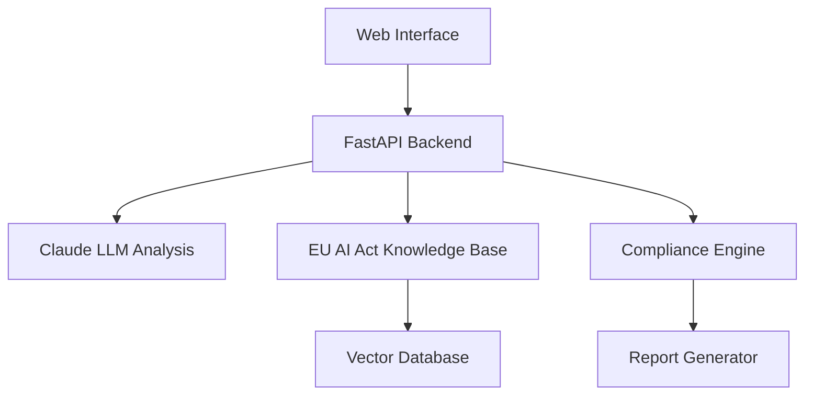

# EU AI Act Compliance Bot

🤖 **Automated Regulatory Assessment for AI Systems**

[](https://opensource.org/licenses/MIT)
[](https://www.python.org/downloads/)
[](https://www.typescriptlang.org/)
[](https://fastapi.tiangolo.com/)
[](https://nextjs.org/)

> **Market Opportunity:** EU AI Act enforcement starts 2026 - help companies ensure compliance with automated assessment and recommendations.

## 🎯 What is this?

An AI-powered compliance assessment tool that:
- **Analyzes** your AI systems against EU AI Act requirements
- **Categorizes** risk levels (Unacceptable, High, Limited, Minimal)
- **Recommends** specific compliance actions and timelines
- **Generates** professional compliance reports for stakeholders

## 🚀 Quick Start

### Prerequisites
- Python 3.11+
- Node.js 18+
- Anthropic Claude API key

### Backend Setup
```bash
cd backend
pip install -r requirements.txt
cp .env.example .env  # Add your API keys
uvicorn app.main:app --reload
```

### Frontend Setup  
```bash
cd frontend
npm install
npm run dev
```

Visit `http://localhost:3000` to start your compliance assessment.

## 🏗️ Architecture



**Tech Stack:**
- **Backend:** FastAPI + Python
- **Frontend:** Next.js 14 + TypeScript  
- **AI:** Anthropic Claude for analysis
- **Database:** Vector DB for regulation search
- **Deployment:** Vercel + Railway

## 📋 Features

### Core Functionality
- ✅ **Risk Assessment:** Automated categorization per EU AI Act
- ✅ **Requirement Mapping:** Match your system to specific regulations
- ✅ **Compliance Scoring:** Quantitative assessment with improvement areas
- ✅ **Action Plans:** Prioritized recommendations for compliance
- ✅ **Report Generation:** Professional PDFs for stakeholders

### Advanced Features (Roadmap)
- 🔄 **Multi-language Support:** EN, DE, FR, ES, IT
- 🔄 **API Integration:** Connect with popular AI development frameworks
- 🔄 **Continuous Monitoring:** Track compliance over time
- 🔄 **Expert Consultation:** Connect with legal compliance specialists

## 🎯 Use Cases

### For AI Companies
- Assess new AI products before launch
- Ensure ongoing compliance of deployed systems
- Generate compliance documentation for audits
- Plan compliance roadmaps and budgets

### For Enterprise AI Users
- Evaluate vendor AI solutions for compliance
- Internal AI system governance and risk management
- Due diligence for AI procurement decisions
- Compliance training and awareness

### For Consultants & Legal Tech
- Client assessment tooling
- Compliance service automation
- Risk analysis and reporting
- Expert consultation workflow support

## 📊 Compliance Categories

### Unacceptable Risk (Prohibited)
- Social scoring systems
- Real-time biometric identification in public spaces
- Emotion recognition in workplace/education
- Subliminal manipulation techniques

### High Risk (Strict Requirements)
- Safety components in critical infrastructure
- Educational/vocational training assessment
- Employment decision systems
- Essential service access (healthcare, finance)
- Law enforcement applications

### Limited Risk (Transparency Obligations)
- Chatbots and conversational AI
- Emotion recognition systems
- Biometric categorization
- AI-generated content

### Minimal Risk (No Specific Obligations)
- AI-enabled video games
- Spam filters
- Inventory management systems
- Most other AI applications

## 🛠️ Development

### Project Structure
```
eu-ai-act-bot/
├── backend/           # FastAPI backend
│   ├── app/
│   │   ├── api/       # API routes
│   │   ├── core/      # Core business logic
│   │   ├── models/    # Data models
│   │   └── services/  # External services
│   └── tests/         # Backend tests
├── frontend/          # Next.js frontend
│   ├── src/
│   │   ├── components/ # React components
│   │   ├── pages/     # Next.js pages
│   │   ├── lib/       # Utility functions
│   │   └── types/     # TypeScript definitions
│   └── public/        # Static assets
├── docs/              # Documentation
└── scripts/           # Development scripts
```

### Contributing
1. Fork the repository
2. Create a feature branch (`git checkout -b feature/amazing-feature`)
3. Commit your changes (`git commit -m 'Add amazing feature'`)
4. Push to the branch (`git push origin feature/amazing-feature`)
5. Open a Pull Request

### Running Tests
```bash
# Backend tests
cd backend && python -m pytest

# Frontend tests  
cd frontend && npm test

# End-to-end tests
npm run test:e2e
```

## 🔐 Security & Compliance

- **Data Privacy:** All analysis data encrypted at rest and in transit
- **API Security:** Rate limiting, authentication, and input validation
- **Compliance:** Tool itself designed with privacy-by-design principles
- **Disclaimer:** Tool provides advisory guidance only, not legal advice

## 📈 Business Model

### Freemium Approach
- **Free Tier:** 5 assessments/month, basic reports
- **Pro Tier:** Unlimited assessments, advanced features, PDF exports
- **Enterprise:** Custom integrations, dedicated support, audit trails

### Target Market
- **Primary:** EU-based AI companies and enterprises
- **Secondary:** AI consultants and legal tech professionals
- **Future:** Global expansion as AI regulations spread

## 🗺️ Roadmap

### Phase 1: Foundation (Weeks 1-2)
- Core compliance analysis engine
- Basic web interface
- EU AI Act knowledge base

### Phase 2: Enhancement (Weeks 3-4)  
- Advanced reporting and visualization
- User authentication and project management
- Multi-language support

### Phase 3: Scale (Weeks 5-6)
- API integrations with AI platforms
- Advanced analytics and insights
- Marketing website and user onboarding

### Phase 4: Launch (Weeks 7-8)
- Production deployment and monitoring
- User feedback integration
- Business development and partnerships

## 📞 Support

- **Documentation:** [Full documentation](./docs/)
- **Issues:** [GitHub Issues](https://github.com/Ksushik/eu-ai-act-bot/issues)
- **Discussions:** [GitHub Discussions](https://github.com/Ksushik/eu-ai-act-bot/discussions)
- **Email:** support@eu-ai-act-bot.com

## 📜 License

This project is licensed under the MIT License - see the [LICENSE](LICENSE) file for details.

---

**Built with ❤️ for EU AI compliance**

> ⚠️ **Important:** This tool provides guidance and recommendations based on publicly available EU AI Act text. It does not constitute legal advice. Always consult with qualified legal professionals for compliance decisions.